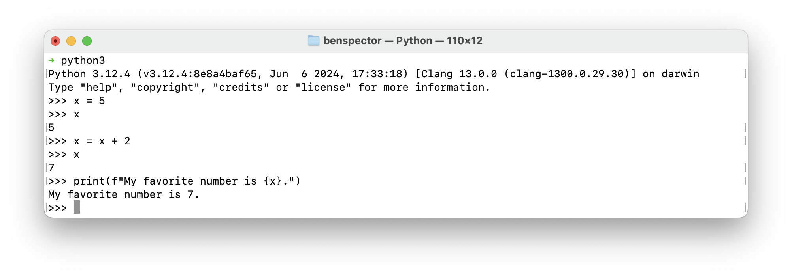

# 1.2 Data Types, Variables, and Operators

**Table of Contents:**

- [Key Terms](#key-terms)
- [Computation is All About Data](#computation-is-all-about-data)
- [Data Types](#data-types)
- [Variables Store Data](#variables-store-data)
  - [Using Variables: Assign, Reassign, Reference](#using-variables-assign-reassign-reference)
  - [Reassign Using the Current Value](#reassign-using-the-current-value)
  - [Naming Conventions](#naming-conventions)
- [Operators](#operators)
  - [Know Your Operators](#know-your-operators)
  - [Operator Type Errors](#operator-type-errors)
  - [Resolution Order of Operations](#resolution-order-of-operations)
  - [Operators in Depth](#operators-in-depth)
    - [Arithmetic Operators](#arithmetic-operators)
    - [Comparison (Relational) Operators](#comparison-relational-operators)
    - [Logical Operators](#logical-operators)
    - [Membership and Identity Operators](#membership-and-identity-operators)
    - [Assignment Operators](#assignment-operators)
    - [The Conditional Expression](#the-conditional-expression)

## Key Terms

- **State** refers to the data stored by a program at a point in time.
- **Data types** are categories of values in Python. There are 5 basic types (`str`, `int`, `float`, `bool`, `None`) and 3 types that hold other data or code (`list`, `dict`, and functions). Knowing the type of a value helps determine how you can use that value. Choosing the right type to represent your data is essential.
- **Variables** are named containers for data. You can **assign**, **reference** and **reassign** variables to store and update information in your program.
  - A variable is created the first time it is **assigned**. Names in `ALL_CAPS` are a signal to readers that a value is a constant and should not be reassigned.
- **`snake_case`** is the Python convention for naming variables and functions: lowercase words joined by underscores, like `days_in_each_month`.
- **Operators** are symbols (e.g. `+`, `>=`, `and`) that generate new data from existing values.
  - **Arithmetic operators** (`+`, `-`, `*`, `/`, `//`, `%`, `**`) calculate a new value from numbers.
  - **Comparison operators** (`==`, `!=`, `<`, `>`, `<=`, `>=`) compare two values and produce a boolean.
  - **Logical operators** (`and`, `or`, `not`) combine or reverse conditions.
  - **Membership operators** (`in`, `not in`) check whether a value is inside a string, list, or dictionary.
  - **Identity operators** (`is`, `is not`) check whether two names refer to the very same object.
  - **Assignment operators** (`=`, `+=`, `-=`, and the rest) store a value in a variable.
- **Operator precedence** is the order in which Python evaluates the operators in an expression, such as multiplication before addition. Parentheses change that order: whatever is inside them is evaluated first.

## Computation is All About Data

Starting from the very first computational device, the abacus, computers were designed to make it easier for humans to manipulate, generate, and visualize data.


What has changed and evolved over time is how quickly our devices can perform those calculations and how sophisticated our ability to generate and visualize data has become. Here are some modern ways that computers make use of data:

- **Rendering images & video**: Calculating pixel positions, color values, and frame rates turns raw math into Netflix streams and 3D games.
- **Navigation systems**: Continuous GPS data (latitude/longitude as numbers) is transformed into live maps, directions, and traffic updates.
- **Social media**: Posts are stored as text data, likes as counts, and relationships as graph data — powering your feed and recommendations.
- **Online shopping**: Prices (numbers), product info (strings), and cart contents (lists of dictionaries) are combined to let you browse, compare, and buy.
- **Music & audio**: Sound waves are stored as numerical data, then processed and streamed as songs, podcasts, and phone calls.
- **Healthcare & fitness apps**: Heart rate, steps, and sleep cycles (all data points) are tracked and analyzed to monitor your health.
- **Artificial intelligence**: Images, text, or speech are converted into numbers (vectors, matrices) that models process to recognize faces, generate text, or translate languages.

In this lesson, we'll learn about the different types of data, how our computers store data in variables, and then the many ways that we can compute new data.

## Data Types

All values have a **data type** that determines what you can do with that value.

For example, you can use numbers to perform mathematical calculations and can use strings to construct messages. Knowing the different data types allows you to choose the best data type for your particular use case.

In Python, there are five basic **data types** to start with: `str`, `int`, `float`, `bool`, and `None`

| Data Type   | Syntax Example           | What It Represents                | Common Use Cases                                                        |
| ----------- | ------------------------ | --------------------------------- | ----------------------------------------------------------------------- |
| **`str`**   | `"hello"` or `'@abc123'` | Text (any sequence of characters) | Usernames, chat messages, product descriptions, search queries          |
| **`int`**   | `50` or `-2`             | Whole numbers                     | Scores in a game, count of likes on a post, a task's position in a list |
| **`float`** | `10.5` or `0.99`         | Numbers with a decimal point      | Prices, averages, percentages, timers                                   |
| **`bool`**  | `True` or `False`        | Truth value                       | Login status, feature toggles (dark mode on/off), win/lose conditions   |
| **`None`**  | `None`                   | Intentional absence of a value    | Representing "no result" or "not yet set"                               |

There are also three types that hold other data or hold code: lists, dictionaries, and functions.

| Type         | Syntax Example                  | What It Represents                           | Common Use Cases                                                                         |
| ------------ | ------------------------------- | -------------------------------------------- | ---------------------------------------------------------------------------------------- |
| **`list`**   | `["apple", "banana", "cherry"]` | An ordered list of similar values            | Storing lists (shopping cart items, game high scores, chat messages)                     |
| **`dict`**   | `{"name": "Alex", "age": 25}`   | A collection of data relating to one "thing" | Storing user profile data, storing data about product (name, description, price, etc...) |
| **function** | `def greet(): print("Hi!")`     | A reusable block of code                     | Performing actions, handling events, calculations                                        |

**Challenge:** Identify the data types of the values below:

```py
[5]
"5"
5
5.0
{ "value": 5 }
def five():
    return 5
```

**<details><summary>Q: Open up YouTube.com. What examples can you come up with for each of the data types listed above?</summary>**

Here are some examples of each of the basic data types:

- `str`: The title of a video
- `int`: The number of views on a video
- `float`: The average rating of a video, or how many seconds into it you are
- `bool`: Indicator for whether or not you have liked (or disliked) a video
- `None`: The current user (when you are logged out)

Here are some examples of each of the other three:

- `dict`: A single video with all of the related data (view count, likes, comments, etc...)
- `list`: All of the comments for a single video
- function: Clicking on the "Subscribe" button triggers some sort of "subscribe" functionality

</details>

## Variables Store Data

Practically every piece of data in a program is going to be "stored" in one way or another. Variables are the first way that we learn how to "store" values in a program.

A **Variable** is a named container for data, kind of like storing something in a locker with your name on it. Storing data in a named variable lets you retrieve and use that data anywhere later in the program as long as the program is running.

Consider the two approaches below to produce the same result. The first does not use variables while the second does. What are the tradeoffs of each approach?

**Approach 1: No Variables**

```python
print("Story time!")
print("This is a story about Ralph.")
print("Ralph is a 22-year-old student at Marcy Lab School.")
print("Every day, Ralph takes the D train from The Bronx to Marcy Lab School.")
print("Ralph spends his day coding.")
print("At the end of the day, Ralph heads home on the D train back to The Bronx")
print("At home, Ralph practices coding some more before bed.")
print("The end")
```

**Approach 2: Variables**

```python
name = "Ralph"
age = 22
school = "Marcy Lab School"
train = "D"
pronoun = "his"
subject = "coding"
borough = "The Bronx"

print("Story time!")
print(f"This is a story about {name}.")
print(f"{name} is a {age}-year-old student at {school}.")
print(f"Every day, {name} takes the {train} train from {borough} to {school}.")
print(f"{name} spends {pronoun} day {subject}.")
print(f"At the end of the day, {name} heads home on the {train} train back to {borough}")
print(f"At home, {name} practices {subject} some more before bed.")
print("The end")
```

**<details><summary>Which approach is easier to read?</summary>**

The first approach can be read directly from the print statements and requires fewer lines of code.

The second one requires you to first remember what each variable stores and then look back at the values of each variable as you read. Well-chosen variable names can help with this.

</details>

**<details><summary>Which approach is easier to maintain as a programmer if we were to change the protagonist from `"Ralph"` to `"Maya"`?</summary>**

We would need to change it in 6 places in the first program but only 1 in the second program.

Variables make it simpler to maintain our code by avoiding having to repeat the same value over and over again. Instead, we store the value once and use it as many times as we like.

</details>

### Using Variables: Assign, Reassign, Reference

There are three things we can do with variables, each with "technical" language that we use to talk about them:

1. **Assign** a variable by giving it a value with the `=` operator. The first time you do this creates the variable in memory.

   ```python
   name = "Ralph"
   age = 22
   school = "Marcy Lab School"
   train = "D"
   pronoun = "his"
   subject = "coding"
   borough = "The Bronx"
   ```

   _Note: Variables can be assigned any kind of data!_

2. **Reference** the value held by the variable by writing the variable's name. Variable references are expressions.

   ```python
   print("Story time!")
   print(f"This is a story about {name}.")
   print(f"{name} is a {age}-year-old student at {school}.")
   print(f"Every day, {name} takes the {train} train from {borough} to {school}.")
   print(f"{name} spends {pronoun} day {subject}.")
   print(f"At the end of the day, {name} heads home on the {train} train back to {borough}")
   print(f"At home, {name} practices {subject} some more before bed.")
   print("The end")
   ```

3. **Reassign** a new value to a variable by using the `=` operator again. Reassigning a variable changes the value on all _future_ references; it doesn't change any references to that variable before the change.

   ```python
   print("Story time!")
   print(f"This is a story about {name}.")
   print(f"{name} is a {age}-year-old student at {school}.")
   print(f"Every day, {name} takes the {train} train from {borough} to {school}.")
   print(f"{name} spends {pronoun} day {subject}.")

   # reassigning train changes its value on all future references
   train = "2"
   print(f"At the end of the day, {name} heads home on the {train} train back to {borough}")
   # output: At the end of the day, Ralph heads home on the 2 train back to The Bronx

   print(f"At home, {name} practices {subject} some more before bed.")
   print("The end")
   ```

### Reassign Using the Current Value

When using the **assignment operator** `=`, whatever is on the right side of the operator resolves first and then is assigned to the variable. We can even reference the _current_ value of a variable to _reassign_ it a new value.

**Predict, then Run**: What is the output of the code below?

```py
count = 1
print(f"count is now {count}")
count = count * 3
print(f"count is now {count}")
```

**<details><summary>Answer</summary>**

```
count is now 1
count is now 3
```

The right side, `count * 3`, uses the current value of `count`, which is `1`, so it evaluates to `3`. The statement then becomes `count = 3`.

</details>

The same result can be achieved using the **augmented assignment** operators `+=`, `-=`, `/=` and `*=` (there are a few more as well but these are the common ones).

The operator `var *= val` is the same as `var = var * val`:

```py
count = 1
print(f"count is now {count}")
count *= 3
print(f"count is now {count}")
```

**Predict, then Run**: What is the output of the code below?

```py
count = 1
count += 5
count *= 2
count /= 3
print(count)
```

**<details><summary>Answer</summary>**

`((1 + 5) * 2) / 3` gives us `4.0`

</details>

### Naming Conventions

Variables should be named using `snake_case`, lowercase words joined by underscores, and describe the data they hold for the best readability.

```py
# Bad: Unclear what the data is
numbers = [31, 28, 31, 30, 31, 30, 31, 31, 30, 31, 30, 31]

# Good: easy to understand the data in the variable
days_in_each_month = [31, 28, 31, 30, 31, 30, 31, 31, 30, 31, 30, 31]

# Bad: descriptive but difficult to read
daysineachmonth = [31, 28, 31, 30, 31, 30, 31, 31, 30, 31, 30, 31]

# Not Pythonic: readable but not conventional in Python
daysInEachMonth = [31, 28, 31, 30, 31, 30, 31, 31, 30, 31, 30, 31]
```

A variable whose value should never change is called a **constant**, and its name is written in `ALL_CAPS`. Every Python programmer reads that as "do not reassign me". But `ALL_CAPS` is only a convention. Python itself doesn't enforce it, so reassigning a constant raises no error, and nothing warns you if you do it by accident.

```python
# Good: a constant. The name tells the reader it will never change.
MAX_GUESSES = 5

# This is still possible though so always be careful!
MAX_GUESSES = 10
```

## Operators

Suppose we had a variable to store the state of a light switch called `is_on`. What data type would you use?

```py
# Strings?
is_on = "Yes"
is_on = "No"
# Booleans?
is_on = True
is_on = False
```

What about storing a `phone_number` value?

```py
# Number?
phone_number = 7185551234
# String?
phone_number = "718-555-1234"
```

**<details><summary>Answer</summary>**

`is_on` should be a boolean because it represents something with only two possible states. Strings also make typos hard to catch. If you write `"yes"` when you meant `"Yes"`, a check like `is_on == "Yes"` is quietly `False`, and the program carries on with the wrong answer. A typo in a boolean, such as `true` instead of `True`, stops the program with a `NameError`, so you find the mistake right away.

`phone_number` should be a string because it is used more like a unique identifier (like an email) than it is as a number that you would do math with.

</details>

How you make that decision depends mostly on what kinds of **operators** you intend to use with the value. Operators are symbols or keywords (e.g. `+`, `>`, `and`, `not`) that produce a value. They are used in a variety of expressions.

- We use numbers when we want to use **arithmetic operators** (`+`, `-`, `*`, `/`, etc...)
  ```py
  celsius = 100.0
  fahrenheit = celsius * 9/5 + 32
  print(f"{celsius}°C is {fahrenheit}°F")
  # Output: 100.0°C is 212.0°F
  ```
- We use booleans when we want to use **logical operators** (`and`, `or`, `not`):
  ```py
  is_on = True
  has_power = False
  generator_is_running = True

  there_is_light = is_on and (has_power or generator_is_running)
  # True and (False or True) -> True and True -> True

  print(f"The lights are on: {there_is_light}")
  # Output: The lights are on: True
  ```
- We use strings when we want to do things like use the **membership operator**:
  ```py
  email = "ben@marcylabschool.org"
  print(f"{email} is a Marcy email: {"@marcylabschool.org" in email}")
  ```

At the bottom of this chapter you can take a deep dive into all of the different kinds of operators. They are:

- **Assignment operators** (`=`, `+=`, `-=`, and the rest) store a value in a variable.
- **Arithmetic operators** (`+`, `-`, `*`, `/`, `//`, `%`, `**`) calculate a new value from numbers.
- **Comparison operators** (`==`, `!=`, `<`, `>`, `<=`, `>=`) compare two values and produce a boolean.
- **Logical operators** (`and`, `or`, `not`) combine or reverse booleans.
- **Membership operators** (`in`, `not in`) check whether a value is inside a string, list, or dictionary.
- **Identity operators** (`is`, `is not`) check whether two names refer to the very same object.

### Know Your Operators

In most cases, Python uses operators in ways that are predictable. Sometimes however, Python will do something unexpected.

For example, if we decided to use strings for `is_on`, `has_power`, and `generator_is_running`, what would this program produce as output? And is it "right"?

```py
is_on = "Yes"
has_power = "No"
generator_is_running = "Yes"

there_is_light = is_on and (has_power or generator_is_running)
# "Yes" and ("No" or "Yes") -> "Yes" and "No" -> "No"

print(f"The lights are on: {there_is_light}")
# Output: The lights are on: No
```

The output is `"No"`, and this is NOT correct! The generator is running, so the lights should be on. The reason why isn't exactly obvious. Let's see:

- Resolving the variables first gives us the expression `"Yes" and ("No" or "Yes")`. With booleans, this gave us `True`. With strings, the same rules hand back one of the strings themselves.
- `or` checks its left side first. If the left side counts as `True`, `or` hands back the left side exactly as it is and never looks at the right side. Otherwise, `or` hands back the right side. Surprisingly, `bool("No")` is `True`, so `"No" or "Yes"` hands back `"No"`.

  ```py
  # Python3 REPL
  >>> bool("No")
  True
  >>> "No" or "Yes"
  'No'
  ```

  Python doesn't recognize `"No"` as a negative value. It just sees a string of text, and any string other than the empty string `""` counts as `True`.

- `and` also checks its left side first. However, if the left side counts as `False`, `and` hands it back; otherwise `and` hands back the right side. `bool("Yes")` is `True`, so `"Yes" and "No"` hands back `"No"`.

  ```py
  # Python3 REPL
  >>> bool("Yes")
  True
  >>> "Yes" and "No"
  'No'
  ```

If you were confused by this example, that is okay. The point of this example is simply to show you that

1. Booleans are the right data type for this problem. With booleans, the logical operators `and` and `or` always produce `True` or `False`, so the result is a correct yes-or-no answer.
2. **There is a concrete and reproduce-able explanation for every unexpected behavior** and it is your job to be aware of that and know how to break down an expression into its parts so you can figure out these rules for yourself. The `python3` REPL program is an excellent way to do that!

**Challenge:** Can you predict what each expression will produce? Some of these get a bit weird. Use the `python3` REPL to test out these expressions once you've made a prediction and check out the **Answers** dropdown below if you are confused.

```python
# What you would expect to happen usually happens
10 + 5 * 2
False and True
not False
not not False
not False and True
not (False and True)
"ana" in "banana"
None is None

# Slightly unexpected results
"10" > "2"
"a" > "B"
8 / 2
"3" * 5
"5" + 5
not 0
not 1
not 2
True + True + False
[1, 2] * 2

# Huh?
0 or "Python"
0.1 + 0.2 == 0.3
[1, 2] == [1, 2]
[1, 2] is [1, 2]
```


The fastest way to check a prediction like these is the **Python REPL**. Run `python3` in the Terminal with no file after it, and you get a prompt that evaluates one expression at a time and prints the result. Type `exit()` to leave.




**<details><summary>Answers</summary>**

```python
10 + 5 * 2
# Result: 20
# Why: Multiplication comes first, then addition -> 10 + (5 * 2)

False and True
# Result: False
# Why: `and` produces True only when both sides are True. The left side is already False, so the result is False.

not False
# Result: True
# Why: `not` flips False to True and True to False.

not not False
# Result: False
# Why: Python works from the inside out. The inner `not False` produces True, and the outer `not` flips that True back to False.

not False and True
# Result: True
# Why: `not` is evaluated before `and`, so this is (not False) and True, which becomes True and True.

not (False and True)
# Result: True
# Why: Parentheses go first. False and True produces False, and then `not` flips it to True. The result matches the line above only by coincidence: not True and False is False, but not (True and False) is True.

"ana" in "banana"
# Result: True
# Why: For strings, `in` checks whether the left string appears anywhere inside the right string as a run of characters in a row: b-ana-na. "nab" in "banana" is False, because those letters never appear in that order.

None is None
# Result: True
# Why: A Python program has only one None, so both sides are the very same object. That is why `x is None` is the standard way to check whether a variable holds None.

"10" > "2"
# Result: False
# Why: Strings are compared character by character, using each character's position in Python's character table, even when the characters are digits. Python compares the first characters, "1" and "2", and "1" comes before "2" in that table. That decides the result, so Python never looks at the "0". To compare the numbers, compare 10 > 2 without the quotes.

"a" > "B"
# Result: True
# Why: The same character-by-character rule applies. Every uppercase letter comes before every lowercase letter in Python's character table, so "a" comes after "B", even though a comes before b in the alphabet.

8 / 2
# Result: 4.0 (not 4)
# Why: `/` always returns a float. Use `//` if you want an integer

"3" * 5
# Result: "33333"
# Why: Multiplying a string by an integer repeats the string

"5" + 5
# Result: TypeError
# Why: + adds two numbers (even different kinds, like 5 + 2.5) or joins two strings, but it has no meaning for a string and a number. Python won't guess whether you meant "55" or 10, so it stops with a TypeError.

not 0
# Result: True
# Why: `not` first decides whether its value counts as True or False. The number 0 counts as False, so `not` flips it to True. Chapter 1.4 explains which values count as false.

not 1
# Result: False
# Why: Every number other than 0 counts as True, so `not` flips 1 to False.

not 2
# Result: False
# Why: 2 counts as True, just like 1 does. `not` never does arithmetic. It always produces True or False.

True + True + False
# Result: 2
# Why: In Python, True evaluates to 1 and False evaluates to 0 in arithmetic contexts

[1, 2] * 2
# Result: [1, 2, 1, 2]
# Why: Like the "3" * 5 example, a list is repeated when multiplied by an integer

0 or "Python"
# Result: "Python"
# Why: `or` hands back the left side if it counts as true, and otherwise hands back the right side. 0 counts as false, so you get "Python". Chapter 1.4 explains which values count as false.

0.1 + 0.2 == 0.3
# Result: False
# Why: A classic computer science trap. Due to how floating-point numbers are represented in binary (base-2), 0.1 + 0.2 actually evaluates to 0.30000000000000004, making the equality check fail.

[1, 2] == [1, 2]
# Result: True
# Why: Both lists hold equal values

[1, 2] is [1, 2]
# Result: False
# Why: Each [1, 2] you type creates a brand-new list, so this line makes two separate lists that happen to hold the same values. `==` asks "are these equal?", which is why the line above is True. `is` asks "are these the very same list?", and two separate lists are not.
```

</details>

### Operator Type Errors

Each type works with some operators and not others. If you use an operator on a type that doesn't support it, the program stops with a `TypeError`:

```python
5 + 2               # the value 7 is created
"hello" + " world"  # the value "hello world" is created

5 * 2               # the value 10 is created
"hello" * "world"   # TypeError: can't multiply sequence by non-int of type 'str'
```

### Resolution Order of Operations

Operators can be combined to form complex expressions. In these cases, understanding the order in which operators are evaluated — also called **operator precedence** — is crucial.

Chapter 1.1 had an example of getting it wrong. This code is meant to convert 212°F to 100°C:

```python
fahrenheit = 212
celsius = fahrenheit - 32 * 5 / 9
print(celsius)  # 194.22222222222223
```

Below is the order of precedence:

1. Anything inside parentheses `()` is evaluated first, then function calls
2. Then arithmetic operators. `**` is evaluated before `*`, `/`, `//`, `%`, which are evaluated before `+` and `-`. Operators at the same level are evaluated left to right.
3. Followed by comparison operators (`<`, `<=`, `>`, `>=`, `==`, `!=`).
4. Then logical operators. `not` is evaluated first, then `and`, then `or`.
5. The conditional expression (`x if condition else y`) and assignment happen last (`=`)

Parentheses `()` can always be used to override the default order and make the evaluation order explicit:

```python
celsius = (fahrenheit - 32) * 5 / 9
print(celsius)  # 100.0
```

**<details><summary>Q: Walk through both versions one operator at a time. At which operation do they differ?</summary>**

Without parentheses:

1. `32 * 5` resolves to `160`, because `*` comes before `-`.
2. `160 / 9` resolves to `17.777...`, because `/` is at the same level as `*` and comes next, left to right.
3. `212 - 17.777...` resolves to `194.222...`.
4. `celsius = 194.222...` assigns the result.

With parentheses:

1. `(212 - 32)` resolves to `180`, because parentheses go first.
2. `180 * 5` resolves to `900`.
3. `900 / 9` resolves to `100.0`.
4. `celsius = 100.0` assigns the result.

They differ right at step 1. Without parentheses, Python multiplies first. With parentheses, Python subtracts first. Every later step works on the number that step 1 produced, so a different first step gives a different final answer.

</details>

The same rules decide how a comparison and a conditional expression fit together. What is the value of `report`?

```python
temperature = 85
report = "hot" if temperature - 10 > 70 else "mild"
```

**<details><summary>Q: So, what is the order of operations? What is the value stored in report?</summary>**

1. `temperature - 10` resolves to `75`, because arithmetic comes before comparison.
2. `75 > 70` resolves to `True`.
3. `"hot" if True else "mild"` resolves to `"hot"`.
4. `report = "hot"` assigns the result.

If arithmetic did _not_ come before comparison, Python would have read the expression as `temperature - (10 > 70)`. That is `85 - False`, which is `85`. The conditional expression would then be checking `85` instead of `True` or `False`. Chapter 1.4 explains that any number other than 0 counts as true, so the result would still be `"hot"`, but only by luck. Try `temperature = 60`. The real order gives `50 > 70`, which is `False`, so the result is `"mild"`. The wrong order gives `60`, which counts as true, so the result is `"hot"`. Knowing the order is what lets you predict the result instead of hoping.

</details>

### Operators in Depth

#### Arithmetic Operators

**Arithmetic Operators**: Perform standard mathematical calculations (such as addition, subtraction, division, and exponentiation) or sequence manipulation like string concatenation and list repetition.

| Operator | Name                        | Compatible Data Types                                         | Behavior & Notes                                                                                                          |
| -------- | --------------------------- | ------------------------------------------------------------- | ------------------------------------------------------------------------------------------------------------------------- |
| `+`      | Addition / Concatenation    | `int`, `float`, `str`, `list`                                 | Numerics: Adds values.<br> <br>Sequences: Concatenates two sequence instances of the **same type**.                       |
| `-`      | Subtraction / Difference    | `int`, `float`                                                | Numerics: Subtracts right operand from left.                                                                              |
| `*`      | Multiplication / Repetition | Numerics: (`int`, `float`)<br> <br>Sequences: (`str`, `list`) | Numerics: Multiplies values.<br><br>Sequences: Multiplies sequence by an `int` to repeat it.                              |
| `/`      | Division                    | `int`, `float`                                                | Always returns a `float`, even if dividing two integers.                                                                  |
| `//`     | Floor Division              | `int`, `float`                                                | Divides and rounds down to nearest integer. Returns `int` if both inputs are `int`; returns `float` if either is `float`. |
| `%`      | Modulus                     | `int`, `float`                                                | Returns the remainder of division.                                                                                        |
| `**`     | Exponentiation              | `int`, `float`                                                | Raises left operand to the power of the right operand.                                                                    |

**Examples**:

```py
5 + 3           # 8
"a" + "b"       # "ab"
10 - 4          # 6
4 * 2.5         # 10.0
"hi" * 3        # "hihihi"
7 / 2           # 3.5
4 / 2           # 2.0
7 // 2          # 3
7.0 // 2        # 3.0
7 % 2           # 1
2 ** 3          # 8
```

---

#### Comparison (Relational) Operators

**Comparison (Relational) Operators**: Compare two values—checking for equality, inequality, or relative order—and return a Boolean value (`True` or `False`).

| Operator | Description              | Compatible Data Types         | Behavior & Notes                                                                                                  |
| -------- | ------------------------ | ----------------------------- | ----------------------------------------------------------------------------------------------------------------- |
| `==`     | Equal to                 | All data types                | Evaluates whether value contents are equal.                                                                       |
| `!=`     | Not equal to             | All data types                | Evaluates whether value contents are not equal.                                                                   |
| `<`      | Less than                | `int`, `float`, `str`, `list` | Numerics: Value comparison.<br> <br>Strings: Lexicographical order.<br> <br>Lists: Element-by-element comparison. |
| `>`      | Greater than             | `int`, `float`, `str`, `list` | Numerics/Strings/Sequences: Ordering test.                                                                        |
| `<=`     | Less than or equal to    | `int`, `float`, `str`, `list` | Numerics/Strings/Sequences: Ordering test.                                                                        |
| `>=`     | Greater than or equal to | `int`, `float`, `str`, `list` | Numerics/Strings/Sequences: Ordering test.                                                                        |

_Note: Comparing incompatible types (e.g., `5 < "hello"`) raises a `TypeError` in Python 3._

**Examples**:

```py
5 == 5              # True
"a" != "b"          # True
3 < 5               # True
10 > 2              # True
[1, 2] <= [1, 2]    # True
5.0 >= 5            # True
5 < "hello"         # TypeError
```

---

#### Logical Operators

**Logical Operators**: Combine or reverse conditions (`and`, `or`, `not`). With booleans, the result is always a single `True` or `False`.

| Operator | Description | Compatible Data Types           | Behavior & Return Value                                                                                                                 |
| -------- | ----------- | ------------------------------- | --------------------------------------------------------------------------------------------------------------------------------------- |
| `and`    | Logical AND | All data types (usually `bool`) | Hands back the left side if it counts as `False`, otherwise the right side.<br><br>With booleans: `True` only if both sides are `True`. |
| `or`     | Logical OR  | All data types (usually `bool`) | Hands back the left side if it counts as `True`, otherwise the right side.<br><br>With booleans: `True` if either side is `True`.       |
| `not`    | Logical NOT | All data types (usually `bool`) | Always produces a boolean: `True` if the value counts as `False`, and `False` if it counts as `True`.                                   |

**Examples**:

```py
True and False      # False
True or False       # True
not True            # False
5 > 3 and 2 > 1     # True
```

Whether a value that is not a boolean counts as `True` or `False` is decided by a rule called truthiness, which chapter 1.4 covers in full. The lights example and the `0 or "Python"` line in the challenge above both depend on that rule.

---

#### Membership and Identity Operators

**Membership and Identity Operators**: Membership operators (`in`, `not in`) test whether a value exists inside a sequence or container; identity operators (`is`, `is not`) test whether two names refer to the very same object.

| Operator | Name               | Compatible Data Types                 | Behavior & Notes                                                                                                                     |
| -------- | ------------------ | ------------------------------------- | ------------------------------------------------------------------------------------------------------------------------------------ |
| `in`     | Membership Test    | Any iterable (`str`, `list`, `dict`,) | Checks if value exists in sequence/container. For `dict`, checks **keys**.                                                           |
| `not in` | Negated Membership | Any iterable                          | Checks if value does not exist in sequence/container.                                                                                |
| `is`     | Identity Test      | All data types                        | `True` if both sides are the very same object, not just equal ones. Used mostly as `x is None`. Chapter 1.7 explains the difference. |
| `is not` | Negated Identity   | All data types                        | The opposite of `is`.                                                                                                                |

**Examples**:

```py
'a' in 'apple'    # True
'x' in {'x': 1}   # True
3 not in [1, 2]   # True
x is None         # True
a is not b        # True
```

---

#### Assignment Operators

**Assignment Operators**: Assign values to variables (`=`) or update a variable's existing value by combining an operation with assignment (such as `+=` or `-=`).

| Operator                                   | Name                 | Compatible Data Types         | Behavior & Notes                                                    |
| ------------------------------------------ | -------------------- | ----------------------------- | ------------------------------------------------------------------- |
| `=`                                        | Simple Assignment    | All data types                | Binds a value to a variable name.                                   |
| `+=`, `-=`, `*=`, `/=`, `//=`, `%=`, `**=` | Augmented Assignment | `int`, `float`, `str`, `list` | Evaluates the operation and stores the result back in the variable. |

**Examples:**

```py
x = 10                      # Simple assignment
x += 5                      # Augmented assignment (add 5 to x and re-bind)
```

#### The Conditional Expression

The **conditional expression** is best seen and then explained:

```python
print("it is even!" if 5 % 2 == 0 else "it is odd!") # prints "it is odd" because 5 % 2 has a remainder of 1, not 0
```

`val_a if bool_expression else val_b` produces one of two values based on the `bool_expression` value:

- `val_a` is produced if the `bool_expression` evaluates to `True`
- `val_b` is produced if the `bool_expression` evaluates to `False`
