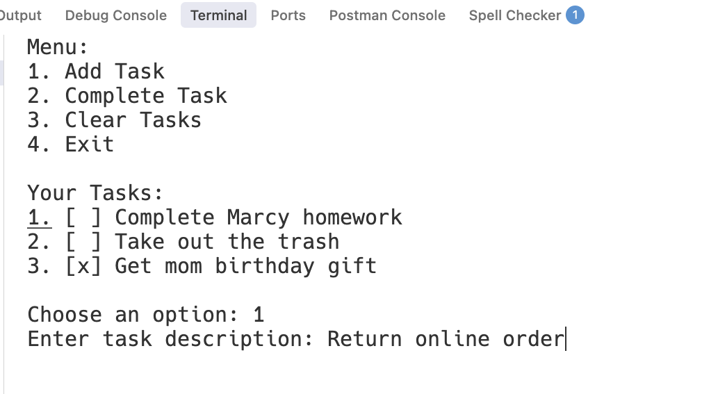

# Case Study: CLI Task Manager


Find the code for this case study from the [GitHub Repository](https://github.com/The-Marcy-Lab-School/swe-casestudy-1-cli-task-manager).

Clone it then follow the **Setup** steps listed in the README.


**Table of Contents:**

- [Key Features and Usage Example](#key-features-and-usage-example)
- [Key Technologies and Packages](#key-technologies-and-packages)
- [Setup](#setup)
- [The Code](#the-code)
  - [Orient Yourself First](#orient-yourself-first)
- [Investigation Questions](#investigation-questions)
  - [User Interface Design](#user-interface-design)
  - [Data Types](#data-types)
  - [Variables and Scope](#variables-and-scope)
  - [Functions](#functions)
  - [Conditional Logic](#conditional-logic)
  - [Looping and Iteration](#looping-and-iteration)
  - [Lists and Dictionaries](#lists-and-dictionaries)
  - [Modules and Testing](#modules-and-testing)
  - [Reading Unfamiliar Code](#reading-unfamiliar-code)
  - [Error Handling and Debugging](#error-handling-and-debugging)
  - [Higher-Order Functions](#higher-order-functions)
  - [Comprehensions and Built-in Iteration](#comprehensions-and-built-in-iteration)
  - [Code Style](#code-style)
- [Extension Opportunities](#extension-opportunities)
  - [Tips](#tips)

This project is a simple command-line task manager where users can add, view, and complete tasks. The application stores tasks in a list of dictionaries, gives users options through prompts, and uses loops and list operations to handle interactions with tasks.

## Key Features and Usage Example

After running the application, the user is presented with a menu of options. They can:

1. Add a new task to their list of tasks
2. Mark a task as completed
3. Delete all tasks from the list
4. Exit the application.

In the screenshot below, you can see a user selecting the "Add Task" option and entering a task description "Return online order".



## Key Technologies and Packages

- Python
- `input()` and `print()` from the built-in functions
- The `os` module from the standard library
- The `pytest` testing library

## Setup

Follow the steps listed in the repository's README

## The Code

The application is three files in a `src` folder with accompanying tests in a `tests/` folder

The app has three modules:

- **`tasks.py`** holds the list of tasks data and functions for manipulating the tasks list.
- **`menu.py`** holds the functions for managing the menu user interface.
- **`main.py`** is the entry point.

### Orient Yourself First

Before you answer any of the investigation questions, read the program to the best of your ability. The first time you do this, you will likely be mostly confused. That's okay, write down what you understand and what you are guessing. Each time you come back to this application, you can go through this process to gauge how well you understand how the application works.

1. **Run it.** Run `python3 src/main.py` from the project folder and use every menu option. Give it bad input as well: a letter where a number belongs, a task number that does not exist, an empty description. Then write one sentence, from the user's point of view, saying what the program does.
2. **Find the entry point and map the files.** For each file in `src/`, read only the `import` lines and the `def` lines, and write one sentence saying what that file is for. Note which file imports which.
3. **Find the data.** Find every variable that lives at the top level of a file, and write down its shape.
4. **Trace one action.** Follow Add Task from the `if __name__ == "__main__":` guard in `main.py` to the confirmation message, and list every function it passes through, in order. If you lose your place, add a `print()` as the first line of each function you think the action passes through, run Add Task again, and read the order the messages appear in. Delete those `print()` lines when you are done.
5. **Predict, then run.** Choose one function in `tasks.py` and predict what it prints for one specific input. For example, predict what `add_task('')` prints. Then check: from the `src` folder, start the REPL with `python3` and run `from tasks import add_task` followed by `add_task('')`.
6. **Write down what you know and what you are guessing.** Keep two lists. Move an item from "guessing" to "know" only after you have checked it by running code.

## Investigation Questions

By answering these questions, you will be required to think critically about how the application is designed and understand WHY it is designed in this way. Your aim should be to:

- learn as much as you can from this application so that you can build an application of your own that leverages these same skills
- communicate clearly about the concepts you are using and the decisions you make for how you implement them.

### User Interface Design

The user interface is how humans interact with our programs. Even in a simple command-line application, thoughtful design choices can make the difference between a frustrating or confusing experience and one that feels intuitive and pleasant to use.

**Question 1** Look at the menu display in `show_menu()`. The menu shows numbered options (1, 2, 3, 4) and asks the user to "Choose an option (1-4)". Why do you think the menu uses numbers for the options? What are the benefits of using numbers? What are potential downsides of having the user type out in words what they would like to do? For example: "Choose an option: add a task, complete a task, clear all tasks, exit".

**Question 2** In the `view_tasks()` function, tasks are displayed with checkboxes: `[x]` for completed tasks and `[ ]` for incomplete tasks. Do you think this visual representation is easy to understand? What alternative ways of displaying this information can you think of? Propose at least one alternative display option.

**Question 3** Look at the `os.system('clear')` call at the end of the `while` loop in `show_menu()`. It occurs after a final `input()` for the user to press Enter and clears the terminal output on each loop. How would the user experience change if we didn't clear the screen? How would it change if we removed the `input()` that comes right before it?

_Tip: Remove the code and re-run the program to see how it changes._

**Question 4** When a user completes a task, the program shows a message like `Task "walk the dog" marked as completed!`. Why is it important that the user sees these messages? How would the user experience change without these messages?

### Data Types

Whether you are designing a new application or learning about an existing one, we always start by asking: _how is the data represented_? Once we know how to represent the data, we are better able to design how the application uses and manipulates it.

**Question 1**

Go to the `tasks.py` file and look at the `tasks` variable. It is a list of dictionaries. Each dictionary represents a task in the list. Each task has a `description` string and an `is_complete` boolean. For the `is_complete` value, we could also have represented it with the numbers: `"is_complete": 0` (incomplete) and `"is_complete": 1` (complete); or as strings `"is_complete": "complete"` and `"is_complete": "incomplete"`. If it were up to you, which would you choose to represent `is_complete` and why?

**Question 2**

In `tasks.py` in the `add_task` function, there is this conditional statement: `if not description:`. What data type does the expression `not description` evaluate to? and what is the purpose of this conditional statement?

**Question 3**

In `menu.py`, the user's chosen task number `task_choice` is converted to a number using the `int()` conversion function. Why is this code necessary? What happens if this type conversion is removed?

### Variables and Scope

Understanding where variables are declared (their **scope**) and therefore where they can be reached is crucial for building well-structured applications. In this CLI Task Manager, we can see variables declared in different locations that serve different purposes.

**Question 1**

In the `show_menu()` function in `menu.py`, the variable `is_running` is assigned `True` before the loop and reassigned to `False` inside it. The `tasks` list in `tasks.py`, by contrast, is never reassigned, and yet its contents change constantly. What is the difference between these two kinds of change? Why can `clear_tasks()` empty the list with `tasks.clear()`, when writing `tasks = []` inside that function would not empty it?

**Question 2**

In the `show_menu()` function in `menu.py`, take a look at the `task_choice` and `task_index` variables. Consider that we could have also written the code without any variables and it would still work properly:

```python
complete_task(int(input('Enter task number to complete: ')) - 1)
```

What are the tradeoffs of these approaches?

**Question 3**

Look at the `tasks` list in `tasks.py`. What is the scope of the `tasks` variable? What would happen if we moved the `tasks = []` line inside one of the functions? Why would this break the application?


**Predict, then run.** In `tasks.py`, delete the whole `tasks = [...]` assignment at the top of the file, and add the line `tasks = []` as the first line of `add_task()`. Run the app. At what moment does it fail, and what is the last line of the error message? Undo the change when you are done.

<details><summary>What actually happens</summary>

It fails before you choose anything, as soon as the menu has printed: `NameError: name 'tasks' is not defined. Did you mean: 'task'?` Python suggests `task` because `view_tasks()` has a loop variable with that similar name. `show_menu()` calls `view_tasks()` every time the menu displays, and `view_tasks()` looks for `tasks` in its own local scope and then in the global scope of `tasks.py`, and finds it in neither. The `tasks` inside `add_task()` is local to `add_task()`, so no other function can reach it. Even `add_task()` could not remember anything with it, because every call would start a brand new empty list.

</details>


### Functions

Functions are the building blocks of reusable code. They allow us to break down complex problems into smaller, manageable pieces and avoid repeating the same code multiple times. Good function design and modular organization make code easier to understand, test, and maintain.

**Question 1**

In `menu.py`, take a look at how the `input()` function is being invoked. Based on what you're seeing, how many parameters does the function seem to have? If you were the designer of that function what name would you give to its parameter?

**Question 2**

What if the programmer had written all the task logic directly in `menu.py` instead of creating separate functions? For example, look at the code inside `clear_tasks()` — imagine copying all of that code and pasting it directly where `clear_tasks()` is called.

```python
elif menu_choice == '3':
    tasks.clear()
    print('All tasks cleared!')
```

Would this code even work? Assuming you could get it to work, what are the downsides of doing this for potentially all of the tasks-related functions?

**Question 3**

What if we combined all the task-related functions (`add_task`, `complete_task`, `view_tasks`, `clear_tasks`) into one giant function called `handle_task_operations()`? What parameters would you need to include in order for it to work with all task-related operations?

### Conditional Logic

Conditional Statements enable programs to behave differently depending on the state of the program. Without them, a program would run the exact same way every time!

**Question 1**

In `menu.py`, the `show_menu()` function uses `if/elif` statements to handle different menu choices. What would happen if we used separate `if` statements instead of `elif`? Try to think through what would happen if a user entered "1" as their menu choice.


**Predict, then run.** In `show_menu()`, change each `elif menu_choice` to `if menu_choice`. Run the app, choose `1`, and add a task. What appears after the confirmation message? Undo the change when you are done.

<details><summary>What actually happens</summary>

The task is added, and then `Invalid option. Please choose 1-4.` appears as well. With separate `if` statements, the `else` belongs only to the last one, `if menu_choice == '4':`. A choice of `'1'` runs the first `if`, and then Python goes on to check the other three. It finds that `'1' == '4'` is `False`, so it runs the `else`. In an `if`/`elif` chain, only the first true condition runs, and the `else` runs only when none of them did.

</details>


**Question 2**

Look at the `add_task()` function in `tasks.py`. The first few lines check `if not description:` and return early if no description is provided. This is called a "guard clause." What would happen if we removed this guard clause and a user tried to add a task with no description?

**Question 3**

Look at the `view_tasks()` function. It checks `if len(tasks) == 0:` before displaying tasks. Why is it there? What would happen if we removed this check and tried to display an empty task list?


**Predict, then run.** Delete the `if len(tasks) == 0:` check and the two lines inside it from `view_tasks()`. Run the app, choose Clear All Tasks, and press Enter. What does the task list show now? Undo the change when you are done.

<details><summary>What actually happens</summary>

The heading `Your Tasks:` appears with nothing beneath it. Nothing crashes, because a `for` loop over an empty list runs zero times. So the check is not there to prevent an error. It is there so that the user reads `No tasks yet. Add one!`, which tells them what to do next, instead of a heading over an empty space.

</details>


### Looping and Iteration

Loops take repetitive tasks and boil them down to a process that can be repeated without having to type the same code multiple times. Choosing the right type of loop and ensuring it terminates properly are crucial skills for any programmer.

**Question 1**

Look at the `show_menu()` function in `menu.py`. There's a `while is_running:` loop that keeps the menu running until the user chooses to exit. What would happen if we forgot to set `is_running = False` when the user chooses option 4 (Exit)? What would happen if we instead forgot the `is_running = True` line before the loop?


**Predict, then run.** Delete the line `is_running = True` from `show_menu()` and run the app. How far does the program get, and what type of error appears? Undo the change when you are done.

<details><summary>What actually happens</summary>

`Welcome to the Task Manager!` prints, and then, before the menu appears: `UnboundLocalError: cannot access local variable 'is_running' where it is not associated with a value`. Because `show_menu()` assigns `is_running = False` further down, Python treats `is_running` as a local variable of `show_menu()` for the whole function. When `while is_running:` runs, that local variable has not been given a value yet. This is the same rule as the `count` example in chapter 1.3.

</details>


**Question 2**

Why is a `while` loop the appropriate type of loop to use to display the menu as opposed to a `for` loop?

**Question 3**

The `while` loop in `show_menu()` has a condition `while is_running:`. This means the loop will continue as long as `is_running` is `True`. What would happen if we changed the condition to `while True:` and removed the `is_running` variable entirely? How else could we break out of the loop?

### Lists and Dictionaries

Lists and dictionaries are the two most common options we have for creating collections of data. Lists are a great choice for grouping together lists of similar values while dictionaries are a great way to represent a single thing that has many data points related to it.

**Question 1**

The entire collection of `tasks` is represented as a list of task dictionaries. Each task dictionary is represented with keys `"description"` and `"is_complete"`. Suppose we instead represented the tasks as a list of strings, such as `['walk the dog', 'take out the trash']`. What are the tradeoffs between a list of dictionaries and a list of strings?

**Question 2**

What ideas do you have for differentiating incomplete tasks and complete tasks?

### Modules and Testing

A module is a file containing code, which can then be imported and utilized in other parts of a larger program or system. Rather than writing all of our code in one file, this project splits the code into three modules: `main.py`, `menu.py`, and `tasks.py`. As a result, we achieve "separation of concerns". The tests in the `tests/` folder import those same modules, and they tell you when a change in one file affects another.

**Question 1**

Look at the top of `menu.py`. You'll see `add_task` is imported. What would happen if we tried to call `add_task()` in `menu.py` without this import statement? Why do we need to explicitly import these functions?

**Question 2**

In `menu.py`, look at the import line: `from tasks import add_task, view_tasks, complete_task, clear_tasks`. Notice that the `tasks` list itself isn't imported, even though Python would allow `from tasks import tasks`. This means that the `menu.py` file can't access it directly. Why do you think the programmer chose to leave `tasks` out of the import?

**Question 3**

If we wanted to add a new feature to the application, giving the user the option to mark all items as complete, how would you split up the code amongst the modules to implement this feature?

**Question 4**

`main.py` ends with `if __name__ == "__main__":`. `menu.py` and `tasks.py` do not have this line. Why does only one of the three files need it?

**Question 5**

With your virtual environment activated, run `python3 -m pytest` from the project folder and check that every test passes. Then, in `clear_tasks()`, change the message `'All tasks cleared!'` to `'Tasks cleared!'`. Before you run the tests again, predict which tests will fail. Why does a test in `test_menu.py` fail when you changed only `tasks.py`? Undo the change when you are done.

### Reading Unfamiliar Code

You read this whole application with the method from chapter 1.10 before you started these questions. Code that a model wrote deserves the same method with more suspicion, because it looks just as confident when it is wrong as when it is right.

**Question 1**

A model was asked to write a `delete_task()` function for the Delete Task extension, and it produced this:

```python
def delete_task(task_index):
    """Remove one task from the list by its index."""
    if task_index < 0 or task_index > len(tasks):
        print('Invalid task number.')
        return

    task = tasks.pop(task_index)
    print(f'Task "{task["description"]}" deleted!')
```

Compare it line by line with `complete_task()`. Then write a bug report for it: a concrete input, the actual output, the expected output, and where the problem is.


**Predict, then run.** Paste the function at the bottom of `tasks.py`. From the `src` folder, start the REPL with `python3`, then run `from tasks import delete_task` followed by `delete_task(2)`. The list starts with the two sample tasks. What happens? Delete the function from `tasks.py` when you are done, because the AI policy keeps code a model wrote out of your own work.

<details><summary>What actually happens</summary>

`IndexError: pop index out of range`. With two tasks, the valid indexes are `0` and `1`, so `2` should be refused. But the guard checks `task_index > len(tasks)`, which is `2 > 2`, which is `False`, so the guard lets `2` through and `tasks.pop(2)` raises the error. `complete_task()` uses `>=`, and that one character is the whole bug. As a bug report: "`delete_task(2)` with two tasks raises `IndexError: pop index out of range`. Expected `Invalid task number.` The guard uses `>` where it needs `>=`."

</details>


### Error Handling and Debugging

Real-world applications must handle unexpected situations gracefully. Understanding how to anticipate, catch, and respond to errors is essential for building robust software. Debugging skills help us identify and fix issues when things don't work as expected.

**Question 1**

What happens when the user enters invalid input (like letters when numbers are expected)? Find the `try` and `except` in `menu.py`. Which line inside the `try` can raise an error, and what type of error is it?

**Question 2**

Now take the protection away. Delete the `try:` line, the `except ValueError:` line, and the `print()` beneath the `except`, and move the two lines that were inside the `try` four spaces to the left. Run the app, choose Complete Task, and type `abc`. Read the traceback from the bottom up. What are the error type and the message? Which file and which line raised the error, and which file started the chain of calls that led there? Undo the change when you are done.

**Question 3**

How does the application handle edge cases like trying to complete a task that doesn't exist? Which function checks for this, and why does it check for _two_ conditions?


**Predict, then run.** Choose Clear All Tasks, then Complete Task, and enter `1`. What message appears, and which line of `tasks.py` produced it?

<details><summary>What actually happens</summary>

`Invalid task number.` With the list empty, `len(tasks)` is `0`, so `task_index >= len(tasks)` is `0 >= 0`, which is `True`, and the guard on line 45 returns before `tasks[task_index]` can raise an `IndexError`. That is the second of the two conditions Question 3 asks about, and it is the one doing the work here. The first, `task_index < 0`, catches a user who types `0`.

</details>


**Question 4**

In chapter 1.6, you checked a string with `isdigit()` before converting it with `int()`. This application uses `try`/`except` instead. Predict what each approach does with the input `-1`. Then type `-1` at the Complete Task prompt. Which part of the program refuses it?

**Question 5**

What debugging techniques could you use to understand what's happening when the program doesn't work as expected?

### Higher-Order Functions

Functions are values. They can be stored in a dictionary, passed to another function, and called later by whoever holds them. A menu program is one of the places where this pays off most clearly.

**Question 1**

Chapter 1.12 described a **dispatch table**: a dictionary that maps each choice to the function that handles it, so that one dictionary lookup replaces a long `if`/`elif` chain. Plan a version of `show_menu()` that uses one. Which menu options can go straight into the dictionary? Which need a small function of their own written first? Which option cannot go into the dictionary at all, and why not? What takes the place of the `else`?

**Question 2**

From the `src` folder, start the REPL with `python3` and run `from tasks import tasks`. Use `sorted()` with a `key` written as a `lambda` to build a list of the tasks with the incomplete ones first. Before you run it, predict whether `False` or `True` sorts first. After it runs, has the order of `tasks` itself changed?

### Comprehensions and Built-in Iteration

Comprehensions and Python's built-in iteration tools abstract away the logic for looping through a list by index and doing something with its values. While the programmer loses some fine-tuned control over how the loop is executed, the improved readability of the code is often worth the tradeoff.

**Question 1**

In the `view_tasks()` function in `tasks.py`, there's a `for` loop: `for index, task in enumerate(tasks, start=1):`. This is a different kind of loop than the `while` loop. What are the tradeoffs of using `for ... in enumerate(...)` when compared to using a `while` loop with a counter, or `for i in range(len(tasks))`?

**Question 2**

Look at the `for` loop in `view_tasks()`. The loop variable is called `task` and it represents each individual task dictionary. What would happen if we changed the variable name from `task` to `item` or `t`? Would the code still work the same way?

**Question 3**

What does the `start=1` argument to `enumerate` do? What would the user see if it were removed?


**Predict, then run.** Remove `start=1` from the `enumerate()` call in `view_tasks()`. Run the app, choose Complete Task, and type the number shown beside "Answer investigation questions". Which task does the confirmation message name? Undo the change when you are done.

<details><summary>What actually happens</summary>

The numbers now start at `0`, so "Answer investigation questions" is shown as `1`. Typing `1` makes `menu.py` subtract 1, which gives index `0`, so the confirmation names "Complete the CLI Task Manager project", the task above the one you meant. The display and the `- 1` in `menu.py` have to agree. `start=1` numbers the tasks from 1 for the user, and the `- 1` turns the user's number back into an index that starts at 0. Change one without the other, and every choice is off by one.

</details>


**Question 4**

The Show Completed Tasks and Show Task Stats extensions both start from the same question: which tasks are complete? Write a function `get_completed_tasks()` that returns a new list of only the completed tasks, using a list comprehension with an `if`. Then write one expression that counts the completed tasks, and use `all()` to decide whether to print `Every task is done!`. Which module should each piece of this code live in?

**Question 5**

Open `tests/test_tasks.py` and find the test for `view_tasks()`. It uses `capsys` to capture what the function printed, because `view_tasks()` prints its output instead of returning it. In chapter 1.13, you tested functions by comparing their return value with `==`. Suppose `view_tasks()` built the same text as a string and returned it, and `show_menu()` printed it. What would the test look like then? What else would that change make easier?

### Code Style

Code style encompasses the conventions and formatting choices that make code readable and maintainable. While the computer doesn't care about spacing or naming conventions, and Python only cares about indentation, these elements are crucial for human developers who need to read, understand, and modify the code. Consistent code style makes collaboration easier and reduces the cognitive load when working with code.

**Question 1**

Look at the indentation in `tasks.py`. Notice how the code inside functions is indented with 4 spaces, and code inside `if` statements is indented even further. How does this indentation impact your ability to understand the code?

**Question 2**

Find the variables, functions, parameters, and dictionary keys in the application (search for `def` and `=`). Do they clearly describe the content they hold / the functionality they perform? What patterns do you see in naming? Why is this important?

**Question 3**

How are imports, functions and code blocks organized? Is there a logical and consistent flow that makes the code easy to follow?

**Question 4**

What do you think the reason is that some files are in the `src` sub-folder while other files are in the root of the project. What is the purpose or benefit of this separation?

## Extension Opportunities

Now that the core Task Manager app is complete, it's time to add new features! Pick at least one feature to implement. If you finish quickly, try more than one!

- **Toggle Complete**: Right now, you can only mark a task as complete. Refactor the "Complete Task" menu option such that the user can toggle a task between complete and incomplete.
- **Delete Task**: Add a menu option to remove a single task from the list.
- **Show Completed Tasks**: Add a menu option to display only tasks that are completed.
- **Show Incomplete Tasks**: Add a menu option to display only tasks that are not completed.
- **Mark All as Completed**: Add a menu option that marks every task as completed.
- **Show Task Stats**: Add a message to the `view_tasks` function that shows the user how many tasks are complete vs. incomplete.
- **Data Persistence**: Look into the `json.dump()` and `json.load()` functions from the `json` module, together with the built-in `open()` function, to figure out how to store the tasks in a `.json` file whenever the user exits and then retrieve those tasks when they start up again.
- **Tests**: The `tests/` folder already tests every function in `tasks.py`. Add tests to `tests/test_tasks.py` for each feature you build, following the pattern of the tests already there, and run them with `python3 -m pytest`.

### Tips

- Add a new menu option for each feature you implement.
- Don't delete old functionality — just extend your app.
- Test your feature with at least 3–4 tasks to make sure it works.
